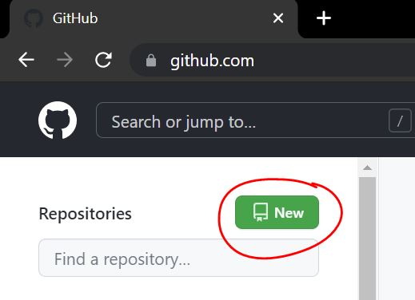
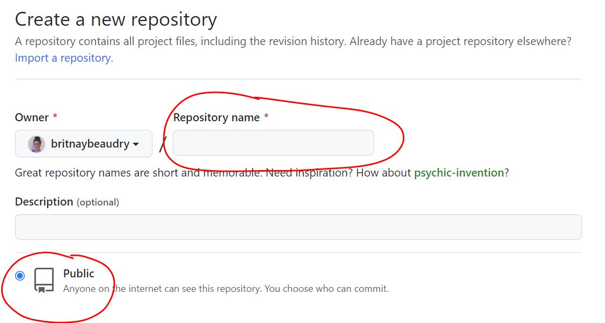
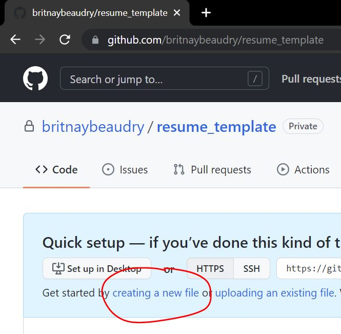
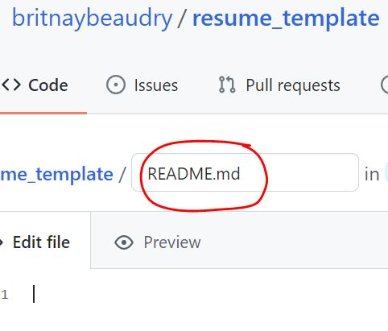
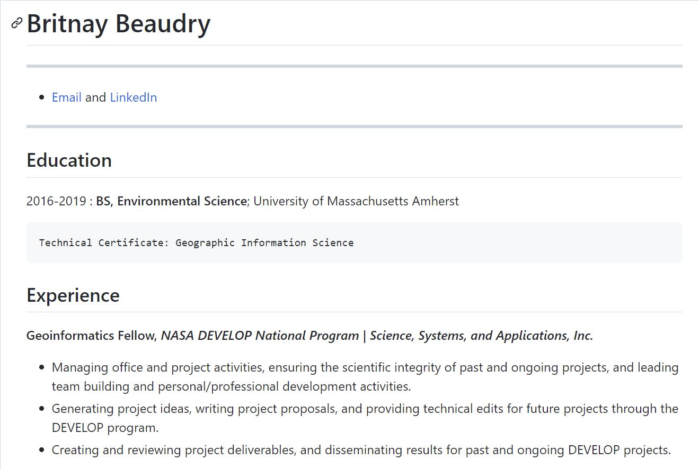

# Professional DEVELOPment Week: How to Showcase Your Skills Online
### What happens when you Google your name? Want to impress recruiters, hiring committees, and more with examples of your work? The following document covers a few ways we can showcase our skills online (and learn some coding basics along the way!)

# What We'll Explore:
* How to create a resume in Markdown
* Making the most of your GitHub Profile
* How to host your own website on GitHub Pages

## Create a Resume in Markdown
* What is Markdown?
* How can I make my resume in Markdown?
* What can I do with a Markdown-style resume?

### What is Markdown?
* Markdown is a language that you can use to format text on the web. It's more complicated than a plain .txt document, but less complicated than HTML.
* Markdown can be a great way to visualize some written word on the web. In Markdown you can make the text **bold**, <em>italicized</em>, ***both bold AND italicized***, and much more! You can even use emojis :alien: :woman_astronaut: :earth_africa: :artificial_satellite:
* **<em>In fact</em>, this tutorial** is written in Markdown! You can check out what Markdown looks like by going to edit the file (<em>hint: click on the pencil icon up on the right!</em>)
* Getting started <em>with</em> Markdown
  * GitHub has a basic guide to Markdown's syntax [here](https://guides.github.com/features/mastering-markdown/).
  * A more in-depth guide to Markdown, covering topics both basic and extended can be found [here](https://www.markdownguide.org/basic-syntax/#paragraphs).
  * We'll be using information from both these guides to help build our resume today.

### How can I make my resume in Markdown?
* Things you will need:
     - [x] [A GitHub account](https://github.com/)
     - [x] Information for your resume
 
#### Step 1: Making a place on GitHub for your resume
If you're new to GitHub, have no fear! In order to start the process for hosting your resume on here, you need to create a new repository. You can do that by clicking the new button up here at the top of the page, circled in red in the image below. You can also see a step-by-step guide [here](https://docs.github.com/en/get-started/quickstart/create-a-repo).
<p align="center">
  <kbd>
    
  </kbd>
</p>

From here, you can name your repository. I recommend that you name it something straight to the point, like "resume" or "yourname_resume". That way, it's easier to remember what's in there. Also, make sure that the repository is set to **Public**, so that people can see it!
<p align="center">
  <kbd>
    
  </kbd>
</p>

Create your repository and add a new file. This is where we will create the resume in Markdown. 
<p align="center">
  <kbd>
    
  </kbd>
</p>

Next, name the file "README.md". The "README" section sets up your repository so that it shows up automatically when people look at the repo here on GitHub. The ".md" section tells GitHub to make this a Markdown file.
<p align="center">
  <kbd>
    
  </kbd>
</p>

Now you have a place to get started on the resume!

#### Step 2: Making the resume in Markdown
* There are a lot of great examples online of resume templates in markdown that you can use if you don't want to start from scratch.
  * [This is a nice, easy to fill-in version](https://github.com/habpippin/professional-development/blob/main/resume_template.md)
  * [This example uses code blocks as a way to highlight projects](https://github.com/aonemd/markdown-resume-template/blob/master/resume.md)
  * [This example has a nice use of line breaks to separate sections](https://gist.githubusercontent.com/mszep/d3235240cc6653d6eeaa/raw/5904b5dc0e19b983fab48b1398057b707dd6d696/resume) 
  * You can look for more templates online, or even look into the Markdown language and start from scratch! Using different text sizes, line breaks, and lists can make a great resume unique to your own style.

If you're using a template, paste the text in your README.md file and edit the information to match that on your own resume. Add and delete sections as necessary for your experience, skills, etc. (<em>Hint: If you use the preview function up at the top of your file, you can see what it looks like in real-time!</em>)

Here is an example of my resume using a template [(You can check it out here)](https://github.com/britnaybeaudry/Professional_DEVELOPment_Week/blob/main/resume_example.md)
<p align="center">
  <kbd>
    
  </kbd>
</p>

### What can I do with a Markdown-style resume? (Exporting your Markdown resume as a PDF)
Oftentimes job applications will ask you to upload a copy of your resume. But that's hard to do when your resume is only hosted online! Luckily, it's possible to export your Markdown resume as a PDF so the formatting stays consistent and any links stay intact.

#### Step 1: Download and install a Markdown editor
Creating a Markdown document is very simiilar to creating a standard text file. It's up to you to decide what your preferred editor is! Here are a couple commonly used options: 
  * [RStudio](https://www.rstudio.com/products/rstudio/download/)
    * RStudio has a number of options for you to use to create your Markdown document. You can create a pure Markdown document, or you could create an R Markdown document that allows you to execute different chunks of code within your document.
  * [LaTeX](https://www.latex-project.org/get/)
    * LaTeX is a document-setting program typically used for scientific or technical documents. It allows you to just type information into a document and it will format it nicely for you! You can create a LaTeX document and save it as a `.md` file to render into a PDF.

Once you install the editor of your choice, copy the raw Markdown text from the resume you created on GitHub and paste it into the editor. Save your document as `resume.md` or similar.

#### Step 2: Turn your `.md` file into a `.pdf` file
There are a different ways to convert a Markdown document to a PDF. You can read about those options [here](https://gist.github.com/justincbagley/ec0a6334cc86e854715e459349ab1446). Not all of those ways will preserve the look of what is called "GitHub-flavored Markdown" though, so we recommend using `grip`.

  1. Open your Terminal (Mac) or Command Prompt (Windows). Use the `cd` command to navigate to the directory where your `resume.md` file is saved. (Your Desktop is usually the simplest choice.)
  2. Run the following commands:
````
pip install grip
grip your_resume_file.md
````
  3. Copy the `http://localhost:NNNN/` URL that `grip` outputs and paste the address into Chrome. This is where `grip` is hosting your resume.
  4. Go to **File > Print... > Save as PDF** and adjust the **Paper Size** setting (under "More Settings") so that your resume fits on a single page.
  5. Name your file `FirstNameLastName_Resume.pdf` so that people will know it's yours!
### You can also host a markdown-style resume online. You can post it on your GitHub, your LinkedIn, or anywhere else you can think of!

## Making the most of your GitHub Profile
Another way to showcase you and your skills is to modify your own GitHub profile with a profile README. Just as the "README" section sets up a repository so that it shows up automatically when people look at it, this profile README shows up right on your GitHub's profile page. It's a great way to attract recruiters to your profile before they even see your code (you can even just add your resume to your profile if you want!). 
Here are some examples of cool profile READMEs if you need inspiration:
   * [Jason Lengstorf's profile](https://github.com/jlengstorf)
   * [Donavon West's profile](https://github.com/donavon)
   * [Cyris' profile](https://github.com/CyrisXD)
   * [Nate Moore's profile](https://github.com/natemoo-re)
   * Here's [my own](https://github.com/britnaybeaudry) that I created after following the tutorial below!
   
[Here](https://aboutmonica.com/blog/how-to-create-a-github-profile-readme) is an awesome guide created by Monica Powell that can get you started on creating your own profile README!

## How can I host my resume (or more) on a GitHub site?
If you want to go even further, you can host your resume as a website on GitHub. It's called [GitHub Pages](https://pages.github.com/). 
With GitHub pages, you can also incorporate HTML and CSS elements. You can make your resume more complex, add things <em>other</em> than just your resume like a bio, blog posts, and more! The choices are endless, and they are yours.
 
Here are some examples of excellent personal websites hosted on GitHub pages:
  * [A list of open source projects happening on Twitter](http://twitter.github.io/)
  * [An easy demo site that shows you the basics of what you can do](http://hankquinlan.github.io/)
  * [Elle Townsend's website](https://www.elletownsend.co.uk/)
  * [Karl Broman's website](https://kbroman.org/)
  * [Caroline William's website](https://cawilliams719.github.io/)

[Here](https://docs.github.com/en/pages/getting-started-with-github-pages/about-github-pages) is GitHub's guide on getting started with your own GitHub page.
I also used [this tutorial](http://jmcglone.com/guides/github-pages/) as well when I created my first website.

You can also get started with some :skull:skeleton code:skull:. Skeleton code usualy refers to a framework that has the foundation or "skeleton" already prepared. In this case, there are examples of pre-made website templates available. All you need to do is follow their directions and provide your own text, images, etc. to have your own site! Some cost money and some are free, but you can check out some options here: https://startbootstrap.com/themes/portfolio-resume 

Even [my current GitHub Pages website](https://britnaybeaudry.github.io/) started from skeleton code. You won't get nearly as much hands-on coding experience as you would from making a website from scratch, but it's still a great option.
